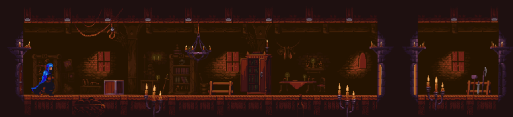

 
# 개요 (Summary)
the_madness 는 간단 한 html5 게임 입니다. 
(the_madness is a simple html5 game.) 
 
평소에 HP.Lovecraft 작품을 좋아했고, 
(I usually liked HP.Lovecraft work,) 
 
보면 안 되는 것을 보아버린... 광기어린 상황을 나타내고 싶었습니다. 
(Saw a terrible situation should not look at... wanted to express insanity.) 
 
 
# 시작 방법 (How to get started)
이 게임은 [rust](https://rust-lang.org) 언어가 설치되어 있어야 합니다.  
(This game requires [rust](https://rust-lang.org) language installed.) 
 
1. 저장소를 복사 합니다.

2. '설치경로'/server 경로에서 'cargo run' 커맨드를 실행 합니다.

3. 컴파일 뒤에 'localhost:8989' 포트로 서버가 실행 되는것을 확인 합니다.

4. '설치경로'/client/index.html 을 웹브라우저 에서 실행 합니다.

해당 웹브라우저가 파일에 접근할 수 있는 옵션을 줘야 합니다. 예를 들어, [Chrome](http://www.chrome-allow-file-access-from-file.com/).

 
1. Copy the repository.

2. Run the 'cargo run' command in the 'InstallPath'/server path.

3. After compile, make sure that the server is running on the 'localhost: 8989' port.

4. Run 'InstallPath'/client/index.html in your web browser.

