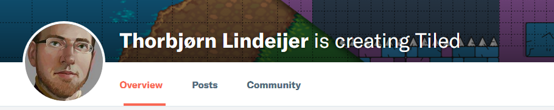

# 개요 (Summary)
the_madness 는 간단 한 html5 게임 입니다.  
(the_madness is a simple html5 game.)  

평소에 HP.Lovecraft 작품을 좋아했고,  
(I usually liked HP.Lovecraft work,)  

보면 안 되는 것을 보아버린... 광기어린 상황을 나타내고 싶었습니다.  
(Saw a terrible situation should not look at... wanted to express insanity.)  

# 시작 방법 (How to get started)
이 게임은 [rust](https://rust-lang.org) 언어가 설치되어 있어야 합니다.  
(This game requires [rust](https://rust-lang.org) language installed.)  

1. 저장소를 복사 합니다.  
2. `설치경로'/server` 경로에서 'cargo run' 커맨드를 실행 합니다.  
3. 컴파일 뒤에 'localhost:8989' 포트로 서버가 실행 되는것을 확인 합니다.  
4. `설치경로/client/index.html` 을 웹브라우저 에서 실행 합니다.  
해당 웹브라우저가 파일에 접근할 수 있는 옵션을 줘야 합니다. 예를 들어, [Chrome](http://www.chrome-allow-file-access-from-file.com/).  

  

1. Copy the repository.  
2. Run the 'cargo run' command in the `InstallPath/server` path.  
3. After compile, make sure that the server is running on the 'localhost: 8989' port.  
4. Run `InstallPath/client/index.html` in your web browser.  

키보드 왼쪽, 오른쪽 키로 이동 합니다.  
(Move to the left and right keys of the keyboard.)  

터치 디바이스는 화면 왼쪽, 오른쪽을 터치해서 이동 합니다.  
(Touch devices are moved by touching the left and right sides of the screen.)  

스페이스바나 말 풍선 아이콘을 클릭해서 음성을 녹음하면,  
(If you record a voice by clicking the space bar or the speech balloon icon,)  

접속 한 다른 플레이어에게 음성을 전송 합니다.  
(Sends voice to other connected players.)  

# 외부 도움 (External help)

+ [Louis Zuno](https://www.patreon.com/ansimuz/overview)  
사용 된 매우 훌륭 한 pixelart 리소스는 모두 그의 작품 입니다.  
저는 그에 후원자 이기도 합니다.  
(All of the very good pixelart resources used are his works.  
I am also a supporter of him.)  

+ [Thorbjørn Lindeijer](https://www.patreon.com/bjorn/overview)  
매우 훌륭 한 `Tiled Editor`를 사용 했습니다.  
저는 그에 후원자 이기도 합니다.  
(I used a very nice `Tiled Editor`.  
I am also a supporter of him.)  

+ [ASEPRITE](https://store.steampowered.com/app/431730/Aseprite/)  
매우 훌륭 한 pixelart 스프라이트 툴 입니다.  
구입 하시는 것을 망설이지 마세요.  
(It is a very nice pixelart sprite tool.  
Do not hesitate to purchase.)  
